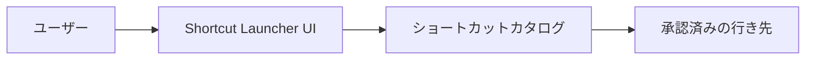

# アーキテクチャ概要

このドキュメントでは、privateリポジトリの実装詳細を公開せずに、概要レベルのアーキテクチャを説明します。

## 概念フロー

## 主な構成要素

### ユーザーインターフェース

インターフェースは、ショートカットを整理済み、検索可能、またはグループ化された形式で表示します。長時間の閲覧ではなく、繰り返し発生するアクセスを素早く行うことを目的としています。

### ショートカットカタログ

カタログは、利用可能な行き先の集合を表します。private実装では、カタログの詳細に社内名称、URL、カテゴリ、メタデータなどが含まれる場合があります。これらの詳細は、この公開リポジトリには含めていません。

### 行き先の処理

ユーザーがショートカットを選択すると、ランチャーは対応する行き先を開きます。公開ドキュメントでは、privateなルーティング、社内URL形式、業務上の命名規則などは説明しません。

## データ境界

公開リポジトリでは、以下を意図的に除外しています。

- 社内向けショートカット情報
- privateなURL
- 認証に関する詳細
- 環境固有の設定
- デプロイ構成

## 実装境界

実装はprivateリポジトリで管理されています。このリポジトリは、アイデア、設計意図、公開可能な範囲のアーキテクチャを説明するためだけに存在します。
