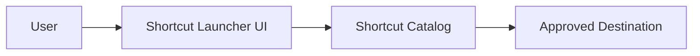

# Architecture Overview

This document describes the architecture at a high level without exposing implementation details from the private repository.

## Conceptual Flow

## Main Components

### User Interface

The interface presents shortcuts in an organized, searchable, or grouped format. It is designed for fast repeated access rather than long-form browsing.

### Shortcut Catalog

The catalog represents the set of available destinations. In the private implementation, catalog details may include internal names, URLs, categories, and metadata. These details are not included in this public repository.

### Destination Handling

When a user selects a shortcut, the launcher opens the corresponding destination. Public documentation avoids describing private routing, internal URL formats, or operational conventions.

## Data Boundaries

The public repository intentionally excludes:

- Internal shortcut records
- Private URLs
- Authentication details
- Environment-specific configuration
- Deployment topology

## Implementation Boundary

The implementation is maintained in a private repository. This repository exists only to explain the idea, design intent, and public-safe architecture.

